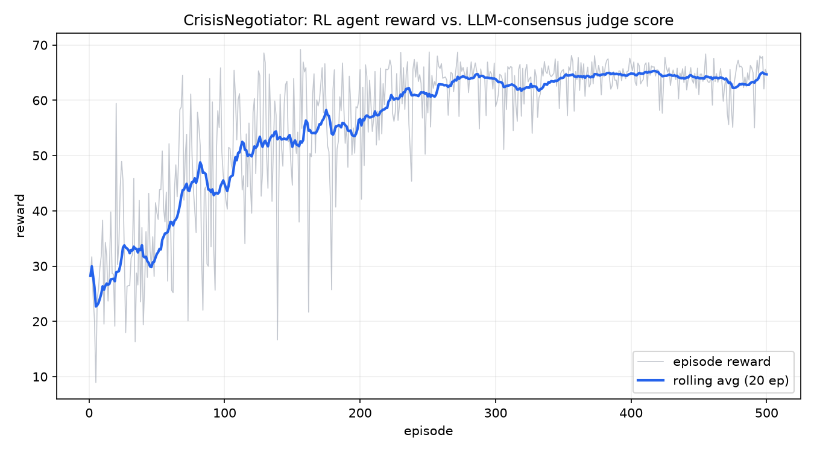

# genlayer-rl-crisis-negotiator

[](LICENSE)
[](https://www.python.org/)
[](https://genlayer.com)

Part of [GenLayer RL Agent Autonomy](https://github.com/luch91-org)
 - a family of independent repos that train reinforcement learning agents
against LLM-consensus reward functions on GenLayer. See the [org
profile](https://github.com/luch91-org/.github) for the
full picture; this repo is domain 1 of 4.

## What this is

A disaster-response environment. An off-chain RL agent decides where to send
drones, ambulances, and supply kits across three zones (or to evacuate a
zone, or to wait). Every decision is scored 0-10 by an LLM judge running
inside a GenLayer Intelligent Contract, and the score only becomes the
agent's reward once a committee of independent validators reaches consensus
on it. The agent never sees the rubric - it only sees the number that comes
back, and learns from that.

## The loop

```
   off-chain (your machine)                  on-chain (GenLayer)
 ┌───────────────────────────┐        ┌──────────────────────────────┐
 │  RL agent                 │  read  │  CrisisNegotiator contract    │
 │  - reads state             │<─────  │  - holds zones + resources    │
 │  - picks an action (ε-greedy)       │  - applies the action         │
 │  - updates Q-table         │  write │  - LEADER calls an LLM to     │
 │    from the reward         │─────>  │    score the new state        │
 │                            │        │  - VALIDATORS agree on the    │
 │                            │ reward │    score via eq_principle     │
 │                            │<─────  │  - records reward on-chain    │
 └───────────────────────────┘        └──────────────────────────────┘
```

**The reward function is immutable once deployed.** The agent optimizes it;
it cannot edit it, and it cannot see the judge's rubric ahead of time. That
constraint is the safety property that makes this loop meaningful - a
scoreboard the student can silently rewrite isn't a scoreboard.

## Prerequisites

- Python >= 3.12 (`genlayer-py` imports `collections.abc.Buffer`, added in
  3.12 - confirmed against the published package source; earlier Pythons
  will fail at import time, not at `pip install` time, which is a nasty
  surprise if you skip this).
- The [GenLayer CLI](https://docs.genlayer.com/developers/intelligent-contracts/tools/genlayer-cli)
  (`npm install -g genlayer`) if you want to deploy via `genlayer deploy`
  rather than `agent/deploy.py`. Requires Node.js only for this CLI - the
  agent itself has no JS dependency.
- A running [GenLayer Studio](https://studio.genlayer.com) / Localnet, or
  access to the Asimov testnet, if you want to train against a real
  deployed contract (`--env genlayer`). Not required for `--env mock`.

## Setup

```bash
git clone https://github.com/luch91-org/genlayer-rl-crisis-negotiator.git
cd genlayer-rl-crisis-negotiator
python -m venv .venv
source .venv/bin/activate   # .venv\Scripts\activate on Windows
pip install -r agent/requirements.txt
```

Lint and test:

```bash
black --check .
isort --check-only .
pytest tests/ -v
```

Train against the free, instant mock environment (default, no network):

```bash
python -m agent.train --env mock --episodes 500
python -m agent.plot
```

This writes `logs/training.txt`, `agent/q_table.json`, and
`docs/learning_curve.png`.

Deploy the contract and train against the real chain:

```bash
# Option A: GenLayer CLI (recommended if you have Node)
genlayer deploy --contract contracts/crisis_negotiator.py

# Option B: pure-Python deploy helper (localnet, studionet,
# testnet_asimov, or testnet_bradbury)
python -m agent.deploy --chain studionet

# then, with the address printed by either of the above:
python -m agent.train --env genlayer --chain studionet --address 0x... --episodes 30
```

### Verified live deployment

This exact contract has been deployed and exercised end-to-end against the
hosted GenLayer Studio network (`https://studio.genlayer.com/api`,
chain `studionet`), 2026-07-03, at:

```
0xE0CBc71F7a3e87523F4A3833d4DdBE8a47595220
```

Sample live step - one on-chain transaction, LLM-judged and
validator-agreed in ~25 s:

```
action: {'type': 'dispatch', 'zone': 'zone_a', 'resource': 'drones', 'quantity': 1}
reward=7.0  (24.8s)
reason='Drones dispatched to moderate zone (zone_a) is responsive but not
        critical; resource efficiency is good with remaining drones.'
```

A short live training run (3 episodes × 4 steps = 12 on-chain
LLM-consensus transactions, 463.6 s total, ~39 s/step) showed climbing
episode rewards - 10.0 → 12.0 → 23.0 - and is committed at
[`logs/training_live_studionet.txt`](logs/training_live_studionet.txt):

```
episode=1 reward=10.000 rolling_avg=10.000 epsilon=0.8000 reason='Dispatching supply kits to an already evacuated zone is a po'
episode=2 reward=12.000 rolling_avg=11.000 epsilon=0.6400 reason='Zone B is stable, so sending 1 supply kit is reasonably effi'
episode=3 reward=23.000 rolling_avg=15.000 epsilon=0.5120 reason='Dispatching 1 supply kit to the only non-evacuated stable zo'
Training complete: 3 episodes in 463.6s, env=genlayer, states_seen=4, final_rolling_avg=15.000, final_epsilon=0.5120
```
Note the hosted Studio network is a shared sandbox that may be reset at
any time - if the address above stops resolving, redeploy with the one
command shown in Option B and substitute your fresh address.

## Sample training log

```
[10/500] reward=38.31 rolling_avg=26.34 epsilon=0.9044 reason='waited with no critical zones left'
[100/500] reward=44.39 rolling_avg=44.84 epsilon=0.3660 reason='dispatched ambulances to stable zone'
[300/500] reward=58.88 rolling_avg=63.82 epsilon=0.0490 reason='waited with no critical zones left'
[500/500] reward=65.03 rolling_avg=64.69 epsilon=0.0100 reason='waited with no critical zones left'
Training complete: 500 episodes in 0.1s, env=mock, states_seen=29, final_rolling_avg=64.691, final_epsilon=0.0100
```

(Real output from `python -m agent.train --env mock --episodes 500 --seed
42`. Episode reward sums over 8 steps; divide by 8 for a per-step score - 
the rolling per-step average climbs from roughly 3.3 in early,
mostly-random episodes to 8.1 once the policy converges. Without `--seed`
your exact numbers will differ.)



## Repository layout

```
.
├── contracts/
│   ├── crisis_negotiator.py   # the Intelligent Contract (GenVM-only)
│   └── logic.py                # pure-Python state machine + reward parsing (testable)
├── agent/
│   ├── env.py                  # Env protocol + MockEnv + GenLayerEnv
│   ├── agent.py                 # tabular Q-learning
│   ├── train.py                 # python -m agent.train
│   ├── plot.py                  # python -m agent.plot
│   ├── deploy.py                 # python -m agent.deploy
│   └── requirements.txt
├── tests/
│   ├── test_contract.py
│   └── test_agent.py
├── docs/
│   ├── tutorial.md
│   └── learning_curve.png
├── logs/training.txt
├── CLAUDE.md
└── .github/workflows/ci.yml
```

See [docs/tutorial.md](docs/tutorial.md) for a deep dive into the contract,
the reward prompt, the mock-vs-live tradeoff, and hyperparameter tuning.

## Versioning

Semantic versioning; first tag `v0.1.0-alpha`. Trained `agent/q_table.json`
is attached to each GitHub Release so a reviewer can load a working agent
without retraining.

## Contributing

Issues and Discussions are open. See the [org profile](https://github.com/luch91-org/.github)
for how this repo fits into the broader GenLayer RL Agent Autonomy project.
